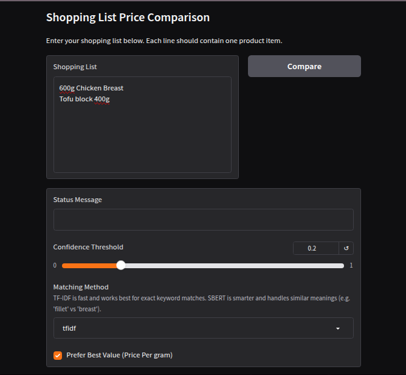
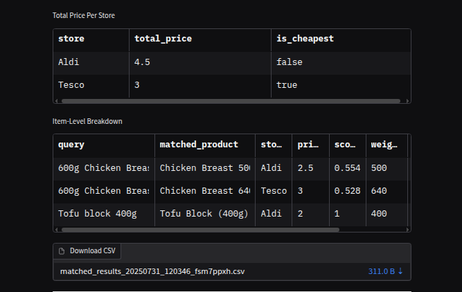
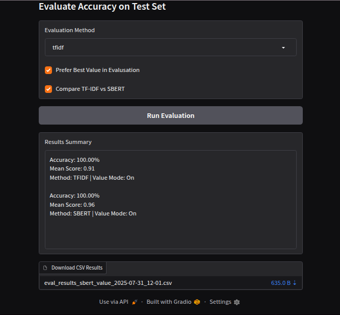

# Product Matching System

A prototype that compares shopping lists across supermarkets using AI-based fuzzy matching.  
Runs on sample data, but designed for real-world use.

Built by Millie Jackson @Nested{Loop}

---

##  Features
- Smart Matching using TF-IDF or SBERT
- Understands weights (e.g. "600g", "1.2kg")
- Optional value-based matching (price per gram)
- Total price per store + itemised breakdown
- Built-in test set for model evaluation
- CSV download of results

---

## How It Works

**1. Text Cleaning**  
Lowercase, remove symbols, normalise spacing

**2. Quantity Parsing**  
Extract weights (e.g., "1.2kg") and convert to grams

**3. TF-IDF Embedding**  
Represent product names as vectors

**4. Matching Logic**  
Combine name similarity + size penalty to rank best candidates

---

## Example Inputs
Paste a shopping list like:

```
600g Chicken Breast
Tofu Block 400g
Cheese Slices
```

Adjust the confidence threshold or switch methods to see differences.



---

## Evaluation Mode
- Use the evaluation tool at the bottom of the app to:
- Compare TF-IDF vs SBERT
- See accuracy on a test dataset
- Download evaluation CSV


---

🧪 Try it yourself (locally):

Run `python app.py`

Then visit: `http://127.0.0.1:7860`

---

## Tech Stack
- Python
- Pandas
- Scikit-learn
- SentenceTransformers
- Gradio

Hosted on: Hugging Face Spaces

---

## Features

- Smart product matching using TF-IDF or SBERT
- Understands quantity units like "1.2kg" or "400g"
- Optional scoring by price per gram (value-based matching)
- Price comparison per store
- Evaluation mode with accuracy stats and CSV export

---

## 🗃️ How It Works

**1. Text Cleaning**  
Lowercase, remove symbols, normalise spacing

**2. Quantity Parsing**  
Extract weights (e.g., "1.2kg") and convert to grams

**3. TF-IDF Embedding**  
Represent product names as vectors

**4. Matching Logic**  
Combine name similarity + size penalty to rank best candidates

---

## Example Input

```text
600g Chicken Breast
Tofu Block 400g
Cheese Slices
```

You can adjust the **confidence threshold** and toggle between **TF-IDF** and **SBERT** to see different results.

---

## High-Level Flow

```text
User Shopping List
       ↓
 Text Cleaning + Weight Extraction
       ↓
Similarity Matching (TF-IDF or SBERT)
       ↓
 Optional Value Adjustment (Price Per Gram)
       ↓
 Store-Level Matching + Total Price Calculation
       ↓
 CSV Download + Evaluation Reporting
```

---

## Repository Structure

```
matchers/
│
├── clean_text.py           # Text cleaning pipeline for normalising product names
├── evaluator.py            # Test set evaluation logic + accuracy scoring
├── product_matcher.py      # Core matcher using name + weight similarity
├── quantity_parser.py      # Extracts weights from product strings
├── sbert_matcher.py        # Sentence-BERT matcher using pretrained embeddings
├── store_matcher.py        # Per-store product matching and basket pricing
├── tfidf_matcher.py        # TF-IDF vectoriser-based matcher
│
data/
├── supermarket_products.csv  # Sample product data
├── testset.csv               # Test queries and expected matches
│
reports/
├── eval_results_*.csv        # Auto-generated evaluation results
│
app.py                      # Gradio app for UI demo (entry point)
requirements.txt            # Minimal dependencies for deployment
README.md                   # You're here!
```

---

## Evaluation Mode

Use the built-in evaluation tool to:

- Run automated matching on a labelled test set
- Compare TF-IDF and SBERT performance
- Export results to CSV
- See accuracy and average similarity score

---

## About

**Author:** Millie Jackson  
**Freelance Lab:** Nested{Loop}  
**Portfolio (Coming Soon):** [milliejackson.dev](https://milliejackson.dev)  
**Hugging Face:** [huggingface.co/MillieJackson](https://huggingface.co/MillieJackson)
**LinkedIn:** [LinkedIn](https://www.linkedin.com/in/millie-jackson7/)

---

## License

This repository is for demonstration and portfolio purposes only. Contact Millie to discuss commercial use, adaptations, or collaboration.

---
