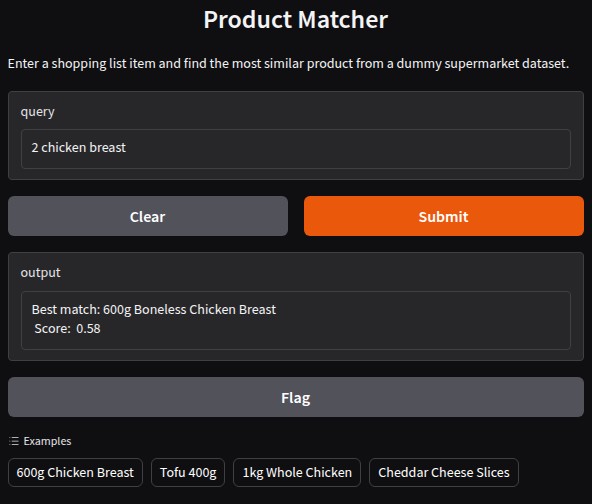

# 🛒 Product Matching System: Smarter Shopping List Comparisons

## 💡 Project Summary

This project demonstrates a smart matching system that compares products across different supermarkets — even when names, sizes, and packaging vary. It solves a real-world freelance use case: helping users build shopping lists and find the best total price across stores.

When a user adds an item like “600g chicken breast,” the system finds the closest equivalent product in each supermarket, handling own-brand variations and size mismatches.

---

## 🚀 Features

✅ Clean and normalise product names
✅ Extract and compare product quantities (e.g., "1.2kg" vs. "600g")
✅ Calculate similarity using TF-IDF vectorisation
✅ Penalise matches with large size mismatches
✅ Simple CLI and Gradio interfaces for testing

---

## 📂 File Structure
product-matching/
|
├── data/
│   └── sample_products.csv
├── matchers/
│   ├── clean_text.py          # Text cleaning and formatting
│   ├── tfidf_matcher.py       # TF-IDF similarity scoring
│   ├── quantity_parser.py     # Extract and normalise weights
│   └── product_matcher.py     # Combine text + size matching
├── demo.py                    # CLI output testing script
├── interface.py               # CLI + Gradio demo interface
└── README.md

---

## 📊 Sample Output (CLI)

Original:      600g Boneless Chicken Breast
Cleaned:       600g boneless chicken breast
Parsed weight: 600g
----------------------------------------
Original:      1.2kg Whole Chicken
Cleaned:       12kg whole chicken
Parsed weight: 1200g
----------------------------------------
Query:        600g Chicken Breast
Best match:   Chicken Thighs 600g
Match score:  0.7423

Users can enter a shopping list item (like "600g Chicken Breast") and instantly see the best-matching product from a mock supermarket database.

🧪 Try it yourself (locally):

Run `python interface.py`

Then visit: `http://127.0.0.1:7860`

---

## 🗃️ How It Works

**1. Text Cleaning**

Lowercase, remove symbols, normalise spacing

**2. Quantity Parsing**

Extract weights (e.g., "1.2kg") and convert to grams

**3. TF-IDF Embedding**

Represent product names as vectors

**4. Matching Logic**

Combine name similarity + size penalty to rank best candidates

---

## 🔧 Tech Stack

- Python 3
- `scikit-learn` for text vectorisation and similarity
- `re` for pattern matching
- `gradio` for interactive demo

---

## 🧠 Learning Highlights

- Applied NLP to real-world product descriptions
- Used TF-IDF and cosine similarity for semantic matching
- Parsed structured features (quantities) with regex
- Combined numeric + text similarity for smarter search
- Created a clean, modular structure ideal for portfolios

---

## 🧩 Possible Extensions

- Add support for transformer embeddings (e.g. SBERT)
- Show full ranked match list instead of just top result
- Handle multiple query items (full shopping lists)
- Load real product data from supermarket APIs
- Build API or Streamlit dashboard for production use

---

